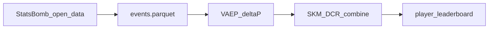

# SKM — Skill-Key Moments

**Open pipeline for process-based player valuation in football.**

Today: **SKM v1** scores every on-ball action with VAEP **ΔP** plus difficulty (**D**), context (**C**), and role (**R**). Tomorrow: a **moment-based** metric that credits players for involvement in match-winning phases—not only the ball carrier. See the [roadmap](docs/ROADMAP.md).

**v0.1.0** · Bundesliga 2023/24 (StatsBomb open, 34 matches) · sklearn VAEP · **no Homebrew required**

```
SKM_i = ΔP_i × (1 + 0.3·D_i + 0.3·C_i + 0.3·R_i)
```

Built on [StatsBomb open data](https://github.com/statsbomb/open-data) via [socceraction](https://github.com/ML-KULeuven/socceraction).

---

## Architecture (v1)



| Stage | CLI | Output |
|-------|-----|--------|
| Ingest + features | `skm-build-events` | `data/processed/events.parquet` |
| VAEP + SKM | `skm-build-scores` | `actions_scored.parquet`, `player_leaderboard.parquet` |
| Validation | `skm-validate` | `data/reports/` (local, gitignored) |
| Dashboard | `streamlit run app/streamlit_app.py` | Interactive leaderboard |

---

## v1 limitations (honest)

SKM v1 is **SKM-Chance**: an action-level proxy, not the final moment-based metric.

| Finding (open sample) | Implication |
|----------------------|-------------|
| ρ(skm, ΔP) ≈ **0.996** | SKM ≈ VAEP net value today; D/C/R add little on this sample |
| ρ(skm, progressive_per90) ≈ **−0.11** | Progressive mids under-rewarded vs attack-leaning actions |
| ρ(skm, xG) ≈ 0.25; assists ≈ 0.47 | Not a goals/assists clone, but still offense-skewed |
| Action-level only | Off-ball and moment structure → [Phase 5–6](docs/ROADMAP.md) |

Reproduce: `skm-validate` after Phase 2. Tier 3 compares to FotMob via [`data/external/bundesliga_2324_benchmarks.csv`](data/external/bundesliga_2324_benchmarks.csv).

---

## Quickstart

```bash
git clone https://github.com/YOUR_USERNAME/skm-football.git
cd skm-football
chmod +x scripts/setup_venv.sh
./scripts/setup_venv.sh
source .venv/bin/activate

skm-build-events --max-matches 3    # smoke test (~few min)
skm-build-scores --max-games 5
skm-validate
streamlit run app/streamlit_app.py
```

Full Bundesliga open sample:

```bash
skm-build-events                      # ~25 min first run
./scripts/run_full_phase2.sh
skm-validate && skm-export-reports
```

---

## Setup (detailed)

You already have numpy + pandas + pyarrow? **Skip to step B.**

### A — Fresh install

```bash
cd ~/Documents/projects/skm
rm -rf .venv
chmod +x scripts/setup_venv.sh
./scripts/setup_venv.sh
source .venv/bin/activate
```

### B — If setup failed on `scipy`

```bash
cd ~/Documents/projects/skm
source .venv/bin/activate
pip install --upgrade pip wheel
pip install --only-binary=:all: "numpy>=1.26.0,<2.0.0" "scipy>=1.13.1,<1.15" "scikit-learn>=1.4.2,<1.6"
pip install statsbombpy tqdm python-dotenv hatchling pytest ruff
pip install -e ".[dev]"
pip install socceraction lightgbm
pip install streamlit plotly matplotlib
pip install -e ".[model,app]" --no-deps
python -c "import numpy, pandas, scipy, sklearn, socceraction; print('All OK')"
```

---

## Validation

```bash
skm-export-reports    # scatter plots, hidden heroes, CSVs → data/reports/
skm-validate          # Tier 1–3 Spearman + external benchmarks
```

- **Tier 1:** SKM vs ΔP, xT, assists, xG, progressive actions
- **Tier 2:** Outcome correlations (reports not committed; regenerate locally)
- **Tier 3:** Merge FotMob/FBref from `data/external/bundesliga_2324_benchmarks.csv`

Example tension on the sample: **Nathan Tella / Victor Boniface** rank high on SKM per90 but FotMob ~7.13–7.16; **Granit Xhaka** FotMob ~8.18 vs lower v1 SKM—motivation for moment + control layers in v2. See [case studies](docs/CASE_STUDIES.md) and [market positioning](docs/SKM_MARKET_POSITIONING.md).

---

## Documentation

| Doc | Purpose |
|-----|---------|
| [docs/PICKUP.md](docs/PICKUP.md) | **Resume here** — commands for next session |
| [docs/COMPLETE_BUILD_PLAN.md](docs/COMPLETE_BUILD_PLAN.md) | Master plan: vision, Phases 4–8, validation, blog |
| [docs/BUILD_PLAN.md](docs/BUILD_PLAN.md) | v1 snapshot + publish checklist |
| [docs/ROADMAP.md](docs/ROADMAP.md) | Phases 5–8: moments, unified `skm_per90`, context, AI |
| [docs/SKM_MARKET_POSITIONING.md](docs/SKM_MARKET_POSITIONING.md) | Honest claims vs G+A, FotMob, transfer market |
| [docs/CASE_STUDIES.md](docs/CASE_STUDIES.md) | Blog player buckets (illustrative) |
| [docs/RELATED_WORK.md](docs/RELATED_WORK.md) | VAEP, xT, positioning |
| [PROGRESS.md](PROGRESS.md) | Build checklist |
| [CONTRIBUTING.md](CONTRIBUTING.md) | Dev setup, tests |

---

## Publish to GitHub

```bash
chmod +x scripts/publish_to_github.sh
./scripts/publish_to_github.sh skm-football YOUR_GITHUB_USERNAME
```

1. Create an **empty** public repo at https://github.com/new named `skm-football` (do not add README or .gitignore).
2. `git push -u origin main`

If `gh` is installed, the script may create and push automatically.

---

## Troubleshooting

| Error | Fix |
|-------|-----|
| `scipy` metadata-generation-failed | `pip install --only-binary=:all: "scipy>=1.13.1,<1.15"` |
| socceraction vs numpy 2 | Use `numpy>=1.26,<2.0` |
| `import numpy` segfault | `rm -rf .venv` and rerun setup |
| XGBoost libomp | VAEP defaults to sklearn GBM (no libomp) |
| `brew: command not found` | Not required for this project |

---

## Data attribution

StatsBomb open data — credit [StatsBomb](https://github.com/statsbomb/open-data) when publishing.

## License

MIT — see [LICENSE](LICENSE).
