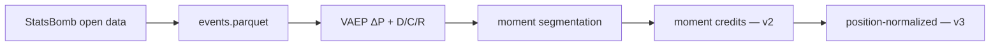

# SKM — Skill-Key Moments

[](https://github.com/ChinmayA301/skm-football/actions/workflows/ci.yml)
[](LICENSE)

An open, reproducible pipeline for **process-based player valuation** in
football — built to answer a specific complaint: goals and assists reward
the final touch, but football is a chain-reaction sport, and most of what
decides matches happens before the ball reaches the box.

SKM values every on-ball action by its downstream effect on scoring
probability (VAEP), then adjusts for **how difficult** the action was,
**how much the moment mattered**, and **whether it was expected of the
player's role** — before rolling actions up into match **moments** and
crediting every player involved, not only the one who touched the ball
last.

```
SKM_i    = ΔP_i × (1 + 0.3·D_i + 0.3·C_i + 0.3·R_i)
AdjSKM_i = SKM_i × position_w × role_w × game_state_w × sequence_w
```

**Sample:** StatsBomb open data, 216 matches across 5 competitions
(Bundesliga 2023/24 · World Cup 2022 · Euro 2024 · Ligue 1 2022/23 ·
La Liga 2020/21) · 487,561 scored actions · 233 players with ≥400 actions.

**What's validated:** two pre-registered targets — SKM shouldn't be a VAEP
clone (ρ < 0.99) and shouldn't punish progressive midfield work (ρ > 0) —
both pass under the position-normalized ranking. Real defender-position
data (StatsBomb 360) lifts the difficulty model's held-out accuracy from
0.69 to 0.83 AUC. Full numbers: [docs/RESULTS.md](docs/RESULTS.md).

Data: [StatsBomb open data](https://github.com/statsbomb/open-data) ·
Models: [socceraction](https://github.com/ML-KULeuven/socceraction) (VAEP, SPADL, xT)

---

## How it works



| Stage | Command | Output |
|---|---|---|
| Ingest + features | `skm-build-events` | `events.parquet` |
| VAEP + SKM (v1 / v1.5) | `skm-build-scores` | `actions_scored.parquet`, `player_leaderboard.parquet` |
| Moment segmentation | `skm-build-moments` | `moments.parquet`, `moment_players.parquet` |
| Moment credits (v2) | `skm-build-credits` | `player_credits.parquet`, `player_skm_v2.parquet` |
| Real defender geometry (360) | `skm-build-360` | `D_360`, `skm_360` |
| Position-normalized (v3) | `skm-build-phase6` | `player_skm_v3.parquet` |
| Validation | `skm-validate` | `data/reports/` (generated locally) |
| Match replay | `skm-export-replay --game-id <id>` | Self-contained HTML with live SKM overlays |
| Dashboard | `streamlit run app/streamlit_app.py` | Interactive explorer |

---

## Quickstart

```bash
git clone https://github.com/ChinmayA301/skm-football.git
cd skm-football
chmod +x scripts/setup_venv.sh
./scripts/setup_venv.sh
source .venv/bin/activate

skm-build-events --max-matches 3
skm-build-scores --max-games 5
skm-validate
streamlit run app/streamlit_app.py
```

Full multi-competition sample (216 matches, ~15 min):

```bash
skm-build-events --competitions "1. Bundesliga:2023/2024,FIFA World Cup:2022,UEFA Euro:2024,Ligue 1:2022/2023,La Liga:2020/2021"
skm-build-scores --competitions "1. Bundesliga:2023/2024,FIFA World Cup:2022,UEFA Euro:2024,Ligue 1:2022/2023,La Liga:2020/2021"
skm-build-moments && skm-build-credits && skm-build-phase6
skm-validate && skm-export-reports
```

---

## The dashboard

`streamlit run app/streamlit_app.py` opens seven tabs:

| Tab | What it shows |
|---|---|
| Leaderboard | Sortable SKM / adjusted SKM / ΔP / xT per-90 rankings |
| Match timeline | Cumulative SKM by team across a single match |
| Player profile | Per-player D/C/R component breakdown (radar chart) |
| Hidden influence | Players ranked much higher by SKM than by xT or goals |
| Validation | Tier 1–3 correlations against ΔP, xT, outcomes, and public ratings |
| Moments | Moment map per match, top moments, v1-vs-v2 rank movers |
| Label moments | Collects pairwise "which moment mattered more" judgments for the expert-preference calibration in [docs/ROADMAP.md](docs/ROADMAP.md) |

To deploy this dashboard on Streamlit Cloud, see [docs/DEPLOY.md](docs/DEPLOY.md).

## Match replay

`skm-export-replay --game-id <id>` renders a self-contained HTML page
that replays a real match's event stream on a 2D pitch — moments flagged
as they happen, cumulative team SKM bars, a live top-player ticker — with
an optional mode to overlay the same flags on a local video clip you own,
synced to the match clock. No broadcast footage is bundled or fetched.

---

## Validation

```bash
skm-export-reports
skm-validate
```

- **Tier 1:** SKM vs ΔP, xT
- **Tier 2:** vs goals, assists, xG, progressive actions
- **Tier 3:** vs FotMob ratings in [`data/external/bundesliga_2324_benchmarks.csv`](data/external/bundesliga_2324_benchmarks.csv) (Bundesliga slice only)

Reports write to `data/reports/` (not committed; regenerate after building scores). Full headline results: **[docs/RESULTS.md](docs/RESULTS.md)**.

---

## Known limits

| Limit | Why it's there |
|---|---|
| ρ(v3, progressive/90) is barely positive (+0.06) | The position-normalization fix works, but the effect is modest — next lever is moment-type weighting, not more tuning |
| 216-match sample mixes club and tournament contexts | Not full seasons; FotMob benchmark coverage is Bundesliga-only |
| Off-ball involvement not credited | StatsBomb 360 samples positions at event time only, not continuously |
| Position/weight priors are hand-set, not fitted | Disclosed and clipped to modest ranges (see [docs/RESULTS.md](docs/RESULTS.md)) |
| No knockout-stage weighting yet | Deferred to Phase 7 |

---

## Documentation

| Document | Description |
|---|---|
| [docs/RESULTS.md](docs/RESULTS.md) | Validated findings and headline numbers |
| [docs/ROADMAP.md](docs/ROADMAP.md) | Vision and what's next |
| [docs/SKM_MARKET_POSITIONING.md](docs/SKM_MARKET_POSITIONING.md) | What SKM can and cannot claim vs. market stats |
| [docs/CASE_STUDIES.md](docs/CASE_STUDIES.md) | Example players (validation narratives) |
| [docs/RELATED_WORK.md](docs/RELATED_WORK.md) | VAEP, xT, and related frameworks |
| [docs/WORKED_EXAMPLE.md](docs/WORKED_EXAMPLE.md) | One real action, fully decomposed |
| [docs/DEPLOY.md](docs/DEPLOY.md) | Streamlit Cloud deployment |
| [CONTRIBUTING.md](CONTRIBUTING.md) | Setup, tests, and contribution guide |

---

## Requirements

- Python 3.9+
- `numpy>=1.26,<2.0` (required by socceraction)
- VAEP uses sklearn `GradientBoostingClassifier` by default (no XGBoost/OpenMP required)

See [CONTRIBUTING.md](CONTRIBUTING.md) for install troubleshooting.

---

## Data attribution

This project uses [StatsBomb open data](https://github.com/statsbomb/open-data). Credit StatsBomb in any publication or derivative work.

## License

MIT — see [LICENSE](LICENSE).
