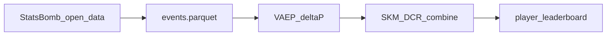

# SKM — Skill-Key Moments

Open-source pipeline for **process-based player valuation** in football.

**SKM v1** scores every on-ball action with VAEP **ΔP** plus difficulty (**D**), context (**C**), and role (**R**). The long-term goal is a **moment-based** metric that credits players for involvement in match-winning phases—not only the ball carrier. See the [roadmap](docs/ROADMAP.md).

**v0.2.0-dev** · StatsBomb open data, 216 matches across 5 competitions
(Bundesliga 23/24 · World Cup 2022 · Euro 2024 · Ligue 1 22/23 · La Liga 20/21) · sklearn VAEP

```
SKM_i      = ΔP_i × (1 + 0.3·D_i + 0.3·C_i + 0.3·R_i)
AdjSKM_i   = SKM_i × position_w × role_w × game_state_w × sequence_w   (v1.5)
```

Data: [StatsBomb open data](https://github.com/statsbomb/open-data) · Models: [socceraction](https://github.com/ML-KULeuven/socceraction) (VAEP, SPADL, xT)

---

## How it works



| Step | Command | Output |
|------|---------|--------|
| Ingest + features | `skm-build-events` | `data/processed/events.parquet` |
| VAEP + SKM | `skm-build-scores` | `actions_scored.parquet`, `player_leaderboard.parquet` |
| Moments (Phase 5) | `skm-build-moments` | `moments.parquet`, `moment_players.parquet` |
| Moment credits (Phase 5b) | `skm-build-credits` | `player_credits.parquet`, `player_skm_v2.parquet` |
| Validation | `skm-validate` | `data/reports/` (generated locally) |
| Dashboard | `streamlit run app/streamlit_app.py` | Interactive explorer |

---

## Quickstart

```bash
git clone https://github.com/ChinmayA301/skm-football.git
cd skm-football
chmod +x scripts/setup_venv.sh
./scripts/setup_venv.sh
source .venv/bin/activate

skm-build-events --max-matches 3
skm-build-scores --max-games 5
skm-validate
streamlit run app/streamlit_app.py
```

Full open-data sample (34 matches):

```bash
skm-build-events
./scripts/run_full_phase2.sh
skm-validate && skm-export-reports
```

---

## v1.5 — Adjusted SKM weighting layer

On top of base SKM, each action gets four modest multiplicative weights
(`src/skm/models/weights.py`), producing `adjusted_skm`:

| Weight | What it captures | How it's built |
|--------|------------------|----------------|
| `position_weight` | Is this action type core to the player's position? (e.g. ST shot, DM interception, W take-on) | Hand-set prior table over StatsBomb starting positions × SPADL types, clipped 0.9–1.25 |
| `role_weight` | Is this action type central to the player's *observed* role? | Role-cluster action rates vs global rates (data-driven), clipped 0.85–1.2 |
| `game_state_weight` | Leverage: garbage time down (0.7 at ±3+), late close games up (1.3 at 85'+, ±1) | Running score + minute, clipped 0.6–1.4 |
| `sequence_weight` | Credit the chain, not only the shooter | Non-shot actions in same-team chains ending in a shot get 1.15 |

Design intent: a routine tap-in at 4–0 no longer gets the same boost as a
late finish in a close game, and buildup actions before a shot share credit.

**Caveats (disclosed, not hidden):** `position_weight` is a prior table, not a
fitted model; `game_state_weight` overlaps partially with C (both kept small);
sequence chains are a same-team/time-gap heuristic, not tracked possessions.
The open sample has no knockout matches, so competition-stage weighting is
deferred (see roadmap Phase 7).

---

## v1 limitations

SKM v1 (**SKM-Chance**) is an **action-level** proxy, not the final moment-based metric.

| Finding (Bundesliga 23/24 open sample) | Implication |
|--------------------------------------|-------------|
| ρ(skm, ΔP) ≈ 0.996 | SKM tracks VAEP net value closely today |
| ρ(skm, progressive_per90) ≈ −0.11 | Progressive midfield work is under-rewarded |
| ρ(skm, xG) ≈ 0.25; assists ≈ 0.47 | Not a pure goals/assists stat, but offense-skewed |
| 216-match multi-competition sample | Mixes club + tournament contexts; FotMob benchmarks cover the Bundesliga slice only |

Example: **Tella / Boniface** rank high on SKM per90 with modest FotMob season ratings; **Xhaka** has a top FotMob rating but lower v1 SKM—motivation for moment-based v2. Details in [case studies](docs/CASE_STUDIES.md) and [market positioning](docs/SKM_MARKET_POSITIONING.md).

---

## Validation

```bash
skm-export-reports
skm-validate
```

- **Tier 1:** SKM vs ΔP, xT  
- **Tier 2:** vs goals, assists, xG, progressive actions  
- **Tier 3:** vs FotMob benchmarks in [`data/external/bundesliga_2324_benchmarks.csv`](data/external/bundesliga_2324_benchmarks.csv)

Reports are written to `data/reports/` (not committed; regenerate after building scores).

---

## Documentation

| Document | Description |
|----------|-------------|
| [docs/ROADMAP.md](docs/ROADMAP.md) | Vision and planned phases (moments → unified SKM) |
| [docs/SKM_MARKET_POSITIONING.md](docs/SKM_MARKET_POSITIONING.md) | What SKM can and cannot claim vs market stats |
| [docs/CASE_STUDIES.md](docs/CASE_STUDIES.md) | Example players (validation narratives) |
| [docs/RELATED_WORK.md](docs/RELATED_WORK.md) | VAEP, xT, and related frameworks |
| [PROGRESS.md](PROGRESS.md) | Implementation status |
| [CONTRIBUTING.md](CONTRIBUTING.md) | Setup, tests, and contribution guide |

---

## Requirements

- Python 3.9+
- `numpy>=1.26,<2.0` (required by socceraction)
- VAEP uses sklearn `GradientBoostingClassifier` by default (no XGBoost/OpenMP required)

See [CONTRIBUTING.md](CONTRIBUTING.md) for install troubleshooting.

---

## Data attribution

This project uses [StatsBomb open data](https://github.com/statsbomb/open-data). Credit StatsBomb in any publication or derivative work.

## License

MIT — see [LICENSE](LICENSE).
