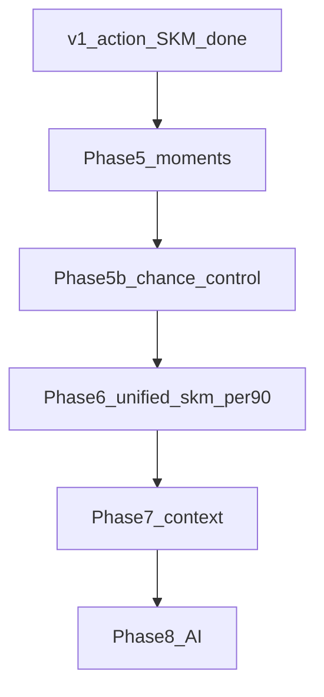

# SKM v1 — Build plan (local copy)

**Frozen:** v0.1.0 · Bundesliga 2023/24 open sample · action-level SKM-Chance  
**Purpose:** Pick up later without Cursor plan files. GitHub target: public `skm-football`.

**Master plan (Phases 1–8, moments, scout study, blog):** [COMPLETE_BUILD_PLAN.md](COMPLETE_BUILD_PLAN.md)

---

## Goal (this milestone)

Ship the **current working pipeline** as a credible open-source v1: reproducible setup, validation story, FotMob benchmarks CSV, and **future ambitions** documented.

**Completed in repo (code + docs):**

| Item | Path |
|------|------|
| Landing README | `README.md` |
| Roadmap Phases 5–8 | `docs/ROADMAP.md` |
| Market positioning | `docs/SKM_MARKET_POSITIONING.md` |
| Case studies (illustrative) | `docs/CASE_STUDIES.md` |
| FotMob benchmarks | `data/external/bundesliga_2324_benchmarks.csv` |
| Publish script | `scripts/publish_to_github.sh` |
| Progress tracker | `PROGRESS.md` |
| Quick resume | `docs/PICKUP.md` |

**Out of scope for v1 (document only):** `moments.py`, GTM layer, unified `skm_per90`, blog body, Streamlit Cloud.

---

## v1 formula and stack

```text
SKM_i = ΔP_i × (1 + 0.3·D_i + 0.3·C_i + 0.3·R_i)
```

- **Data:** StatsBomb open · 1. Bundesliga 2023/24 · 34 matches
- **VAEP:** sklearn `GradientBoostingClassifier` (`vaep_sklearn.py`) — no Homebrew / libomp
- **Constraints:** `numpy>=1.26,<2.0`; run heavy pandas in **user Terminal** (agent env may segfault)

---

## Validation snapshot (reproduce with `skm-validate`)

| Spearman ρ | vs skm_per90 (approx.) |
|------------|-------------------------|
| delta_p_per90 | 0.996 |
| xt_per90 | 0.83 |
| assists_per90 | 0.47 |
| xg_per90 | 0.25 |
| progressive_per90 | **−0.11** |

**Narrative players:** Tella/Boniface high SKM, FotMob ~7.13–7.16; Xhaka FotMob ~8.18 vs lower v1 SKM → drives Phase 5–6.

---

## Local artifacts (not in git)

| Path | Contents |
|------|----------|
| `data/raw/` | StatsBomb JSON per match |
| `data/processed/events.parquet` | ~137k events |
| `data/processed/actions_scored.parquet` | VAEP + SKM per action |
| `data/processed/player_leaderboard.parquet` | Per-player aggregates |
| `data/reports/` | Tier CSVs, scatter plots (`skm-export-reports`) |
| `.venv/` | Python env |

Regenerate reports before blog:

```bash
cd ~/Documents/projects/skm && source .venv/bin/activate
skm-validate && skm-export-reports
```

---

## Pre-push checklist (GitHub)

```bash
cd ~/Documents/projects/skm && source .venv/bin/activate

./scripts/run_full_phase2.sh          # if leaderboard stale
skm-validate && skm-export-reports
pytest && ruff check src tests

chmod +x scripts/publish_to_github.sh
./scripts/publish_to_github.sh skm-football YOUR_GITHUB_USERNAME
```

1. Create **empty** public repo: https://github.com/new → `skm-football` (no README/.gitignore from GitHub).
2. `git push -u origin main`

---

## Future phases (code not started)



| Phase | Deliverable |
|-------|-------------|
| 5 | `src/skm/models/moments.py`, `moments.parquet`, `moment_players.parquet` |
| 5b | `skm_chance` (v1) + `skm_control` (defensive VAEP, progressive boost) |
| 6 | Single public `skm_per90`; scout 10v10; ρ(skm, progressive) > 0 |
| 7 | Match-relative context, pressure, lineups |
| 8 | AI / counterfactual / tracking; optional `skm_trend` |

Details: [ROADMAP.md](ROADMAP.md). Market claims: [SKM_MARKET_POSITIONING.md](SKM_MARKET_POSITIONING.md).

**North star:** One metric for match-relative “footballing brain” from **moment involvement**, not ball touches alone.

---

## Success criteria (v1 publish)

- [x] README readable without local data
- [x] Roadmap + honest v1 limits documented
- [x] Benchmarks CSV committed
- [ ] Git push to `skm-football`
- [ ] Optional: blog + Streamlit Cloud

---

## Key code paths (v1)

| Module | Role |
|--------|------|
| `src/skm/data/pipeline.py` | `skm-build-events` |
| `src/skm/models/pipeline.py` | `skm-build-scores` |
| `src/skm/models/vaep_sklearn.py` | VAEP fallback |
| `src/skm/models/vaep_delta.py` | ΔP, `defensive_value` (unused in combine yet) |
| `src/skm/models/skm_combine.py` | D/C/R weights |
| `src/skm/viz/validation.py` | Tier 1–3 |
| `app/streamlit_app.py` | Dashboard |

---

## Resume next session

Start with [PICKUP.md](PICKUP.md), then [PROGRESS.md](../PROGRESS.md) unchecked items.
