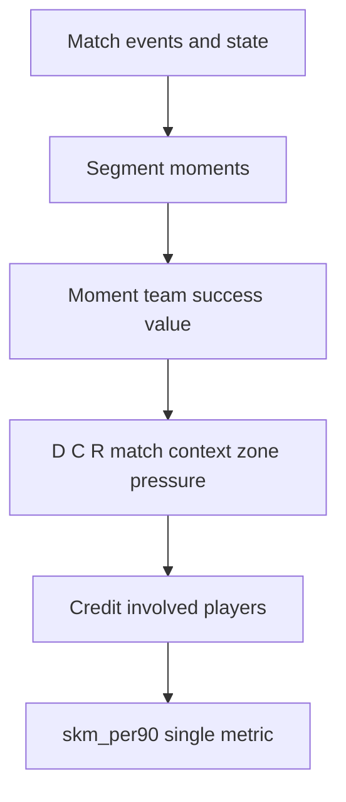
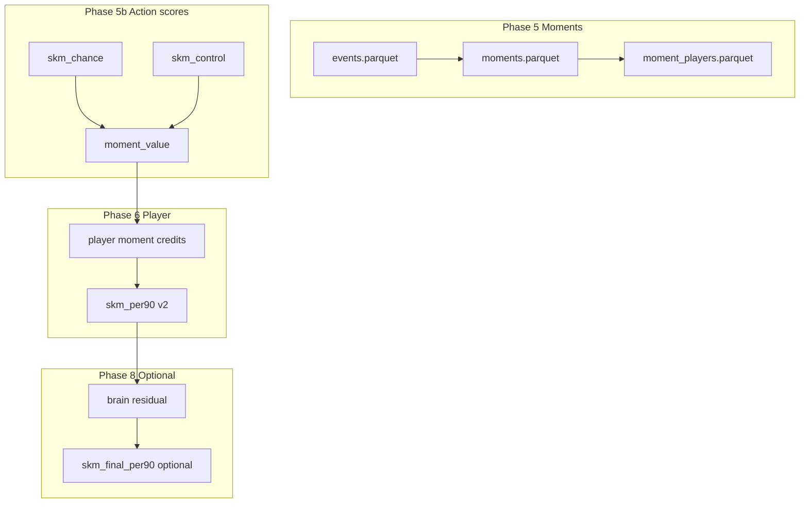

# SKM — Complete build plan (local master copy)

**Saved locally for future pickup.** Execute implementation only when you say “execute the plan” or name a phase (e.g. “execute Phase 5 only”).

**Quick resume:** [PICKUP.md](PICKUP.md) · **v1 publish snapshot:** [BUILD_PLAN.md](BUILD_PLAN.md) · **Checklist:** [../PROGRESS.md](../PROGRESS.md)

---

## 1. Vision and north star

### Canonical definition

Football is a sequence of **moments**: episodes where game state, pressure, and team objectives shift. **Players are involved in each moment**—ball carrier, presser, supporter, space-blocker—not only whoever touches the ball.

**SKM** = how much a player contributed to **successful moments** for their team in that match, weighted by:

- Impact on team success in the moment (ΔP / VAEP offensive + defensive)
- Difficulty (pressure, distance, duel)
- Context (minute, scoreline, competition, match importance, phase type)
- Role (unusual valuable action for this player’s profile)
- Pitch zone and phase (progression, third, transition)
- Involvement share when multiple players share a moment

**Aggregate:** one public number — **`skm_per90`** — plus explainability columns (not separate public leaderboards).



### What SKM is NOT

- Not goals/assists or a disguised xG leaderboard
- Not FotMob / reputation (Tier 3 sanity check only)
- Not sum of ball touches
- Not transfer-fee or youth-potential oracle (without separate SKM-trend + age + tracking)
- Not full off-ball genius until Phase 7–8

### Recommended public claim (Phase 6+)

> SKM identifies players who repeatedly contribute to **match-winning phases** in ways goals and assists miss—not who will cost €80m next summer.

**Avoid:** “SKM replaces scouting” / “predicts potential better than clubs.”

---

## 2. Current state (v1) — honest baseline

### Formula (action engine)

```text
skm_chance_i = ΔP_i × (1 + 0.3·D_i + 0.3·C_i + 0.3·R_i)
```

Files: `src/skm/models/skm_combine.py`, `vaep_delta.py`, `difficulty.py`, `context.py`, `role.py`, `pipeline.py`.

`offensive_value` and `defensive_value` are computed but **only `delta_p` enters SKM today**.

### Known v1 limitations

| Signal | Value | Implication |
|--------|-------|-------------|
| ρ(skm_per90, delta_p_per90) | ≈ **0.996** | SKM ≈ raw VAEP net value |
| ρ(skm_per90, progressive_per90) | ≈ **−0.11** | Midfield chain work under-rewarded |
| ρ(skm_per90, assists_per90) | ≈ 0.47 | Some creation signal |
| ρ(skm_per90, xg_per90) | ≈ 0.25 | Not a pure finisher stat |
| Action-type means | shots/crosses highest; `pass` ~0.002 | Attack-leaning |

### FotMob 2023/24 reference (Tier 3)

See `data/external/bundesliga_2324_benchmarks.csv`.

| Player | SKM/90 (v1 sample) | FotMob BL 23/24 | Story |
|--------|-------------------|-----------------|-------|
| Nathan Tella | 0.908 | 7.13 | High SKM, moderate FotMob |
| Victor Okoh Boniface | 0.908 | 7.16 | Same |
| Florian Wirtz | 0.544 | 7.73 | Both high |
| Alejandro Grimaldo García | 0.503 | 7.98 | Elite FotMob; strong SKM |
| Granit Xhaka | 0.215 | **8.18** | **FotMob loves, SKM v1 underrates** — key v2 test |
| Jeremie Frimpong | 0.411 | 7.27 | Wing impact |

**Caveat:** Full-season FotMob vs 34-match StatsBomb open sample.

### v1 label

Blog and Phase 4: **SKM-Chance (action-level proxy)**, not final moment-based brain metric.

---

## 3. Context dimensions — checklist

| Dimension | v1 today | Phase | Implementation |
|-----------|----------|-------|----------------|
| Action start→end impact | `delta_p` | 5b | + `defensive_value` in `skm_control` |
| Pressure / difficulty | `D`, `under_pressure` | 5b, 7 | Extend to duels, carries |
| Time of game | `C` (75+ min, close game) | 7 | Finer minute buckets |
| Score / match state | `C` (draw, trail by 1) | 5, 7 | Moment-start context multiplier |
| Competition / tournament | — | 7 | League vs cup vs knockout |
| Position / unusual action | `R` (KMeans) | 5b, 7 | Lineup position priors |
| Progressive / pitch third | `progressive` in events | 5b | Zone boost in `skm_control` |
| “Wrong but right” decision | VAEP partial | 8 | Counterfactual / option-set AI |
| Multi-player moment | — | 5 | Involvement allocation |
| Off-ball without touch | — | 7–8 | Pressure events; tracking / AI |
| Single headline metric | `skm_per90` biased | 6 | Sum of **moment credits** |
| Match-relative | weak | 5–7 | Moment portfolio per game |

---

## 4. Architecture (target v2)



### Moment segmentation (`src/skm/models/moments.py` — new)

1. **Possession phase** — same-team chains until turnover/shot/stoppage
2. **Transition** — ±N sec around possession change
3. **Set piece** — optional v2.1
4. **Cap** — split phases > ~45s

### Moment value

```text
moment_value_m = ( Σ skm_action_i in m ) × moment_context_m
skm_action_i = α·skm_chance_i + β·skm_control_i
moment_context_m = f(minute, score, competition, phase_type)
```

### Player allocation (starting weights)

| Role | Share |
|------|-------|
| Primary actor | 1.0 (normalized per moment) |
| Pass recipient | 0.25–0.4 |
| Press in moment | 0.15 |
| Teammate on pitch (Phase 7) | 0.05 capped |

```text
player_skm = Σ_m moment_value_m × share_{p,m}
skm_per90 = player_skm / minutes_est × 90
```

### `skm_control` (Phase 5b — `gtm_layer.py`)

```text
skm_control_i = defensive_value_i × (1 + w_d'·D + w_c'·C + w_r'·R) × zone_pressure_progressive_boost_i
```

**Design lock:** Parallel chance/control metrics are for **internal calibration** until Phase 6; **final product = single `skm_per90`**.

---

## 5. Phase-by-phase build plan

### Phase 1–3 — DONE

- Events: `skm-build-events` → `data/processed/events.parquet`
- Scores: `skm-build-scores` → `actions_scored.parquet`, `player_leaderboard.parquet`
- Validation: `skm-validate`, Streamlit, `data/reports/*`
- Env: Python 3.9 venv, `numpy<2`, sklearn VAEP, heavy runs in **user Terminal**

### Phase 4 — Publish foundation

| ID | Task | Status |
|----|------|--------|
| 4.1 | 34-match `actions_scored.parquet` | Run `./scripts/run_full_phase2.sh` |
| 4.2 | Refresh validation | `skm-validate && skm-export-reports` |
| 4.3 | Tier 3 external merge | `bundesliga_2324_benchmarks.csv` filled |
| 4.4 | Case studies A–E | `docs/CASE_STUDIES.md` illustrative |
| 4.5 | Blog Part 1 | Optional |
| 4.6 | Related work | `docs/RELATED_WORK.md` |
| 4.7 | GitHub | `scripts/publish_to_github.sh` → `skm-football` |
| 4.8 | Streamlit Cloud | Optional |

**Exit:** Repo public; blog does **not** claim moment-SKM complete.

---

### Phase 5 — Moment segmentation + involvement

| ID | Task | Deliverable |
|----|------|-------------|
| 5.1 | `moments.py` + tests | Segment logic |
| 5.2 | `moments.parquet` | `moment_id`, `game_id`, `phase_type`, etc. |
| 5.3 | `moment_players.parquet` | involvement + credit |
| 5.4 | CLI | `skm-build-moments` in `pyproject.toml` |
| 5.5 | QA | Moment distribution; player game-to-game variance |

---

### Phase 5b — Action layers inside moments

| ID | Task | Deliverable |
|----|------|-------------|
| 5b.1 | `gtm_layer.py` + tests | `skm_control` column |
| 5b.2 | Naming | `skm` → `skm_chance` (optional alias) |
| 5b.3 | Roll-up | `moment_value` = α·chance + β·control |
| 5b.4 | Streamlit | Moments debug tab |

**Gates:** ρ(skm_control, progressive_per90) > 0; Xhaka rank lift on control vs chance alone.

---

### Phase 6 — SKM unified (single public metric)

| ID | Task | Deliverable |
|----|------|-------------|
| 6.1 | Moment credit agg | `skm_per90` v2 headline; `SKM_VERSION=2` |
| 6.2 | Explainability | `skm_chance_per90`, `skm_control_per90`, moment counts |
| 6.3 | Tune α, β | Grid on process objectives (not goals) |
| 6.4 | Validation | tier 1b/2b in `validation.py` |
| 6.5 | Scout study | 10 brain mids vs 10 G+A darlings |
| 6.6 | Clip pack | 10–20 moments eye test |
| 6.7 | Blog Part 2 | One moment, Wirtz vs Xhaka |

**Exit criteria:**

| Check | Target |
|-------|--------|
| ρ(skm, progressive_per90) | **> 0** |
| ρ(skm, goals+xG) | ~0.35–0.55 |
| ρ(skm, delta_p) | **< 0.99** |
| Xhaka / Palacios | Rank lift vs v1 |

---

### Phase 7 — Match-relative context

Competition stage, pressure/recovery, lineup presence, finer scoreline/minute curves, re-tune weights. Still **one** `skm_per90`.

---

### Phase 8 — AI layer (future)

1. Counterfactual / option-set (“wrong but right”)
2. Scout residual on labels
3. Moment sequence embeddings
4. Tracking integration

Optional: `skm_final_per90`. Separate product: **`skm_trend`** (YoY Δ + age + minutes) for potential—not raw SKM alone.

---

## 6. Market positioning (summary)

See [SKM_MARKET_POSITIONING.md](SKM_MARKET_POSITIONING.md).

| Question | Answer (after Phase 6–7) |
|----------|--------------------------|
| Better than G+A / naive ratings for process & mids? | Plausible yes if validation passes |
| Better than transfer market for fees? | No alone |
| Better for youth potential? | No alone — need SKM-trend |
| Fixing stats that ignore “brain”? | **Core niche** |

---

## 7. Validation framework

| Tier | What | Output |
|------|------|--------|
| 1 | SKM vs ΔP, xT | `tier1_spearman.csv` |
| 2 | + goals, assists, xG, progressive | `tier2_spearman.csv` |
| 3 | + FotMob CSV | `tier3_*.csv` |
| 4 | Case studies | `docs/CASE_STUDIES.md` |
| 5 | Moment QA + scout 10v10 | Phase 6 exit |
| 6 | Incremental vs xG+xA | Phase 6 exit |

Buckets: A elite both · B hidden influence · C high box low SKM · D same team pair · E FotMob disagreement · **F** mid anchor high control (post–Phase 6).

---

## 8. Blog structure

- **Part 1 (Phase 4):** v1 limits, north star preview, FotMob table, Spearman
- **Part 2 (Phase 6):** moments, one clip, Wirtz vs Xhaka, unified SKM, market claims
- **Part 3 (Phase 8, optional):** counterfactual / tracking

---

## 9. Key files to create or extend

| File | Phase |
|------|-------|
| `src/skm/models/moments.py` | 5 |
| `src/skm/models/gtm_layer.py` | 5b |
| `tests/test_moments.py`, `tests/test_gtm_layer.py` | 5, 5b |
| `src/skm/models/skm_combine.py` | 6 |
| `src/skm/viz/validation.py` | 6 |
| `app/streamlit_app.py` | 5b–6 |
| `data/processed/moments.parquet`, `moment_players.parquet` | 5 |

---

## 10. Environment and ops

- No Homebrew — sklearn VAEP; `numpy<2`, scipy 1.13+
- `.venv` at project root
- Full pipeline in **user Terminal** (not agent shell for pandas)
- Re-run `skm-build-events` if `shot_xg` / `pass_goal_assist` missing

---

## 11. Immediate commands (resume)

```bash
cd ~/Documents/projects/skm && source .venv/bin/activate
./scripts/run_full_phase2.sh
skm-validate && skm-export-reports
python scripts/print_top_players.py
streamlit run app/streamlit_app.py
```

Publish:

```bash
./scripts/publish_to_github.sh skm-football YOUR_GITHUB_USERNAME
git push -u origin main
```

---

## 12. Master phase summary

| Phase | Build focus | Public output |
|-------|-------------|---------------|
| 1–3 | Done | v1 `skm_per90` (action proxy) |
| 4 | Publish + honesty | Blog Part 1, GitHub |
| 5 | Moments + involvement | Internal parquets |
| 5b | chance + control | Debug viz |
| 6 | Unified SKM + scout study | **Single `skm_per90` v2**, Blog Part 2 |
| 7 | Context + off-ball events | Retuned metric |
| 8 | AI / tracking | Optional `skm_final` |

---

## 13. End-state success criteria

- One headline **`skm_per90`** from moment credits
- Match-relative: different games → different SKM for same player
- Beats v1 for mids/defenders (progressive ρ > 0, scout study)
- Does not claim transfer-market or potential superiority
- Traditional stats for **validation only**, not training targets
- Moment clips defend credit to non-shooters

---

## 14. Execute order (when approved)

1. Phase 4 (no formula change)
2. Phase 5 → 5b → 6 (core metric)
3. Phase 7 (context)
4. Phase 8 when data/labels exist
5. Sync `PROGRESS.md` after each phase

Say **“execute the plan”** or **“execute Phase N only”** to begin coding.
