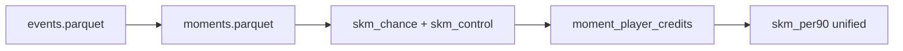

# Roadmap

SKM v1 is an **action-level** process metric. The public headline number will evolve into a **moment-based**, match-relative **`skm_per90`**—still one metric, with explainability columns behind it.

---

## Vision

Football is a sequence of **moments**: short episodes where pressure, scoreline, and team objectives shift. Players should be credited for **involvement in successful moments**—not only ball touches.

**Target pipeline:**

1. Segment the match into moments (possessions, transitions, pressing phases).
2. Score each moment for team success in **that match context**.
3. Allocate credit to involved players (carrier, recipient, presser when observable).
4. Aggregate to **one SKM per 90**—distinct from raw goals/assists or reputation ratings.

See [SKM_MARKET_POSITIONING.md](SKM_MARKET_POSITIONING.md) for claims and limitations.

---

## v1 (released) — SKM-Chance

| Component | Status |
|-----------|--------|
| StatsBomb ingest + event features | Done |
| VAEP ΔP (sklearn) | Done |
| Difficulty **D**, context **C**, role **R** | Done |
| xT column + hidden-influence views | Done |
| Streamlit dashboard + validation CLI | Done |
| Tier 1–3 validation + FotMob benchmarks CSV | Done |
| Bundesliga 2023/24 open sample (34 matches) | Done |

```text
SKM_i = ΔP_i × (1 + 0.3·D_i + 0.3·C_i + 0.3·R_i)
```

**Known limits:**

- Isolated ball actions, not full moments.
- ρ(skm, ΔP) ≈ 0.996 on the open sample; D/C/R add little so far.
- ρ(skm, progressive_per90) ≈ −0.11 — mids under-rewarded vs attack-leaning actions.
- 34-match sample, not full season.

---

## v1.5 (released) — Adjusted SKM weighting layer

```text
adjusted_skm = skm × position_weight × role_weight × game_state_weight × sequence_weight
```

| Component | Status |
|-----------|--------|
| Position priors (StatsBomb lineups → position groups × SPADL types) | Done |
| Role weight from role-cluster action rates | Done |
| Game-state leverage weight (garbage time / late close) | Done |
| Sequence weight (chains ending in shots share credit) | Done |
| `adjusted_skm_per90` in leaderboard + dashboard | Done |

**Known limits:** position weights are hand-set priors; sequence chains are a
heuristic (same team, ≤15 s gaps), not tracked possessions; partial overlap
between game-state weight and C. All weights are clipped to modest ranges so
adjusted SKM stays close to base SKM until the priors are validated.

---

## Phase 5 (released) — Moment segmentation

**Goal:** Unit of account = `moment_id`, not a single action.

| Deliverable | Status |
|-------------|--------|
| `src/skm/models/moments.py` — possession phases, transitions, set pieces, length caps | Done |
| `moments.parquet` — boundaries + start context (score, minute, reason, type) | Done |
| `moment_players.parquet` — per-player involvement shares | Done |
| `skm-build-moments` CLI | Done |

On the open 34-match sample: 12,172 moments (66.6% open play, 21.6% set
piece, 11.8% transition), 7.3% containing a shot, median 3 actions per moment.

**Success criterion** (same player, different matches → different moment
portfolios): 53% of players show varying per-match moment counts on the
34-match sample.

**Known limits:** boundaries are heuristics (team change, ≤20 s gaps, dead
balls, 25-action cap), not StatsBomb possession chains; attack direction is
inferred from shot end locations; involvement is on-ball touch share only —
pressers and off-ball runners enter in Phase 7 when pressure events are
ingested.

---

## Phase 5b (released) — Chance + control layers, moment credits

| Layer | Role | Status |
|-------|------|--------|
| `skm_chance` | Current v1 formula (ΔP × DCR) | Done (alias of `skm`) |
| `skm_control` | Structural boost: progressive / press-resistance / own-third defense | Done |
| `moment_value` | Σ (skm + skm_control) per moment | Done |
| Player credits | `α·own_value + (1−α)·share·moment_value`, α=0.7 | Done |
| `skm-build-credits` CLI → `player_credits.parquet`, `player_skm_v2.parquet` | Provisional v2 leaderboard | Done |

**Correction to the original plan:** defensive VAEP already flows through ΔP
(`delta_p = offensive_value + defensive_value`), so `skm_control` is the
structural boost only — re-adding defensive VAEP would double count. Bonuses
are priced in units of the sample's median positive ΔP (self-calibrating).

**Phase 6 target status on the 34-match open sample (n=18 players ≥400 actions):**

| Target | v1 | v2 (α=0.7) | Met? |
|--------|----|-----------|------|
| ρ(skm, ΔP) < 0.99 | 0.996 | **0.940** | ✅ |
| ρ(skm, progressive_per90) > 0 | 0.079 | −0.102 | ❌ |

**Sensitivity findings (disclosed, not tuned away):** lowering α (more moment
sharing) moves ρ(ΔP) down but makes the progressive correlation *worse* —
touch-share redistribution channels value toward attackers in shot-ending
moments. Raising the progressive bonus 8× only halves the deficit (−0.045).
With ~18–30 qualifying players, forcing the sign positive would be
tuning-to-target on a sample that cannot support it. Deferred to Phase 6
with a larger sample and per-position normalization.

---

## Phase 6 — Unified SKM

**Goal:** Public `skm_per90` = sum of **moment credits**, tuned so:

- ρ(skm, progressive_per90) **> 0**
- ρ(skm, goals+xG) moderate (not a finisher clone)
- ρ(skm, ΔP) **< 0.99**
- Structural mids (e.g. Xhaka) rank higher than in v1

**Validation:** Scout comparison study, moment clip review, extended correlation tiers.

---

## Phase 7 — Match-relative context

- Competition stage (league / cup / knockout)
- Pressure and ball-recovery events as involvement
- Lineup presence for low-touch contributors
- Finer scoreline and minute curves

---

## Phase 8 — Advanced layers (future)

| Priority | Approach |
|----------|----------|
| 1 | Counterfactual / option-set value |
| 2 | Scout-label residual (optional) |
| 3 | Moment sequence embeddings |
| 4 | Tracking data for off-ball |

Optional: `skm_trend` (year-on-year slope + age + minutes) as a separate potential signal—not raw SKM alone.

---

## Target architecture



---

## Related documents

- [CASE_STUDIES.md](CASE_STUDIES.md) — example players
- [RELATED_WORK.md](RELATED_WORK.md) — VAEP, xT, positioning
- [PROGRESS.md](../PROGRESS.md) — implementation status
