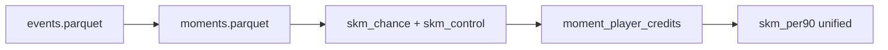

# SKM roadmap

This document describes where **SKM v1** is today and where the project is headed. The public metric will evolve from an **action-level proxy** to a **moment-based, match-relative** footballing-brain score—still one headline number: `skm_per90`.

---

## Vision (north star)

Football is a sequence of **moments**: short episodes where pressure, scoreline, and team objectives shift together. Players are credited for **involvement in successful moments**—not only ball touches.

**Target definition:**

1. Segment the match into moments (possessions, transitions, pressing phases).
2. Score each moment by how much it helped the team in **that match context**.
3. Allocate credit to every involved player (carrier, recipient, presser when observable).
4. Aggregate to **one SKM per 90**—match-relative, not a disguised goals/assists stat.

See [SKM_MARKET_POSITIONING.md](SKM_MARKET_POSITIONING.md) for honest claims vs transfer markets and public ratings.

---

## Released today — SKM v1 (action-level)

| Component | Status |
|-----------|--------|
| StatsBomb ingest + event features | Done |
| VAEP ΔP (sklearn, no Homebrew) | Done |
| Difficulty **D**, context **C**, role **R** | Done |
| xT side column + hidden-heroes viz | Done |
| Streamlit dashboard + validation CLI | Done |
| Tier 1–3 validation (Spearman, FotMob CSV) | Done |
| Bundesliga 2023/24 open sample (34 matches) | Done |

**Formula:**

```text
SKM_i = ΔP_i × (1 + 0.3·D_i + 0.3·C_i + 0.3·R_i)
```

**Known v1 limits (documented, not hidden):**

- Scores **isolated ball actions**, not full match moments yet.
- Correlates ~0.996 with raw ΔP; **under-rewards** progressive mids (ρ vs progressive_per90 ≈ −0.11 on sample).
- Off-ball positioning without events is out of scope until later phases.
- Sample: StatsBomb open Bundesliga subset, not full season.

v1 is **SKM-Chance**: a working pipeline and validation harness for the moment-based metric to come.

---

## Phase 4 — Presentable open source (current)

- [x] Polished README, roadmap, market positioning
- [x] FotMob 2023/24 benchmarks CSV for Tier 3 validation
- [x] CI (pytest, ruff)
- [ ] You: create GitHub repo + `git push` (see README)
- [ ] Optional: blog Part 1, Streamlit Cloud

---

## Phase 5 — Moment segmentation

**Goal:** Unit of account = `moment_id`, not single action.

| Deliverable | Description |
|-------------|-------------|
| `src/skm/models/moments.py` | Possession phases, transitions, length caps |
| `data/processed/moments.parquet` | Moment boundaries + team context at start |
| `data/processed/moment_players.parquet` | Involvement shares per player |

**Success:** Same player, different matches → different moment portfolios.

---

## Phase 5b — Chance + control layers inside moments

| Layer | Role |
|-------|------|
| `skm_chance` | Current v1 formula (ΔP × DCR) |
| `skm_control` | Defensive VAEP + progressive/pressure/zone boost |

Actions roll up into `moment_value`; v1 `skm` column remains for backward compatibility during migration.

---

## Phase 6 — SKM unified (single public metric)

**Goal:** `skm_per90` = sum of **moment credits**, tuned so:

- ρ(skm, progressive_per90) **> 0**
- ρ(skm, goals+xG) **moderate** (not a finisher clone)
- ρ(skm, ΔP) **< 0.99** (moments add structure)
- Mids like Granit Xhaka rank higher than v1 action-sum

**Validation extras:**

- Scout study: 10 “brain” mids vs 10 G+A darlings
- 10–20 moment clips for eye test
- Blog Part 2: one moment, credit split explained

---

## Phase 7 — Match-relative context

- Competition stage (league / cup / knockout) on moments
- StatsBomb pressure, ball recovery as involvement
- Lineup presence for low-touch contributors
- Finer scoreline and minute curves

---

## Phase 8 — AI layer (future)

| Priority | Approach |
|----------|----------|
| 1 | Counterfactual / option-set value (“wrong but right” decisions) |
| 2 | Scout-label residual on top of statistical SKM |
| 3 | Moment sequence embeddings |
| 4 | Tracking data integration for true off-ball |

Optional: `skm_final_per90` with full methodology appendix.

**Potential (separate product):** `skm_trend` = year-on-year SKM slope + age + minutes—not raw SKM alone.

---

## Architecture (target)



---

## How to follow progress

- [PROGRESS.md](../PROGRESS.md) — checklist
- [CASE_STUDIES.md](CASE_STUDIES.md) — blog player buckets
- [RELATED_WORK.md](RELATED_WORK.md) — VAEP, xT, positioning

Contributions welcome after Phase 4 publish; see [CONTRIBUTING.md](../CONTRIBUTING.md).
